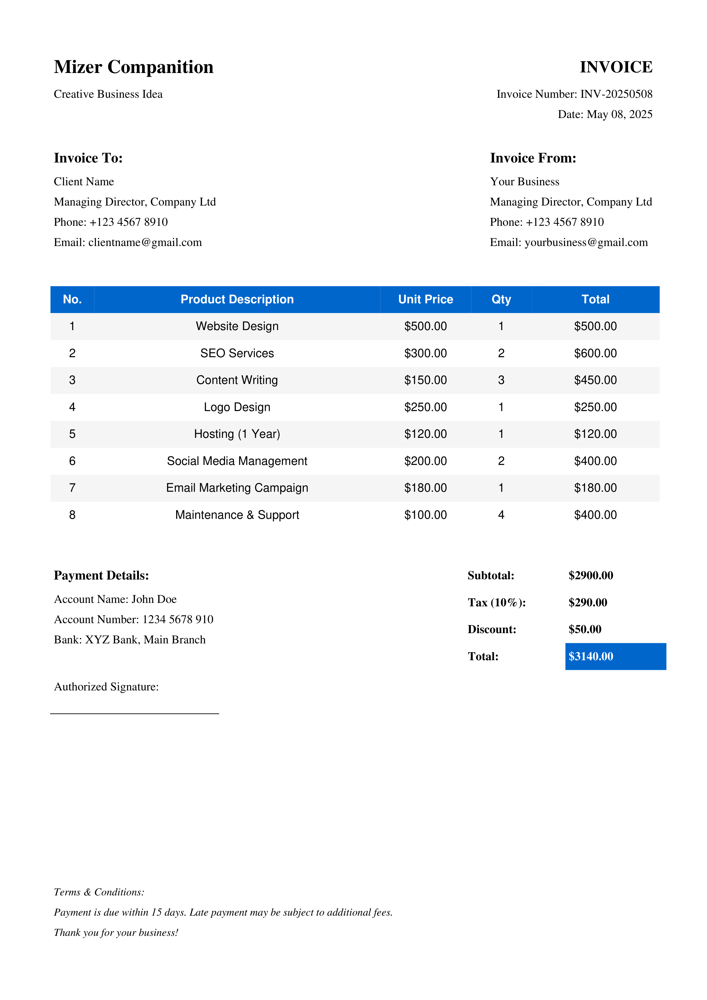

# **Invoice Generator**


A Python-based **Invoice Generator** that creates professional PDF invoices with customizable details, itemized lists, tax calculations, and payment summaries. Built using the `FPDF` library.

## **Features**

✔ **Dynamic Invoice Generation** – Automatically generates invoices with unique invoice numbers and dates.
✔ **Customizable Client & Seller Info** – Add "Invoice To" and "Invoice From" details.
✔ **Itemized Product List** – Supports multiple products with quantity and pricing.
✔ **Automatic Calculations** – Computes subtotal, taxes, discounts, and grand total.
✔ **Professional Styling** – Clean layout with headers, footers, and zebra-striped tables.
✔ **PDF Export** – Save invoices as PDF files for printing or emailing.

---

## **Installation**

### **Prerequisites**

- Python 3.7+
- `fpdf2` library

### **Setup**

1. **Clone the repository** (if applicable):

   ```sh
   https://github.com/Jabulente/Invoice-Generator.git
   ```
2. **Install dependencies**:

   ```sh
   pip install fpdf2
   ```

---

## **Usage**

### **1. Basic Example**

```python
from invoice_generator import PDFInvoice

# Sample invoice items
invoice_items = [
    {"description": "Website Design", "unit_price": 500, "quantity": 1},
    {"description": "SEO Services", "unit_price": 300, "quantity": 2},
]

# Generate PDF
pdf = PDFInvoice()
pdf.set_margins(left=15, top=15, right=15)
pdf.add_page()
pdf.add_invoice_info(to_name="Client Name", from_name="Your Business")
subtotal = pdf.add_table(invoice_items)
pdf.add_summary_section(subtotal=subtotal, tax_rate=0.10, discount=50.00)
pdf.output("invoice.pdf")
```

### **2. Customizing Invoice Details**

Modify the following in `PDFInvoice` class:

- **Header**: Company name, invoice title
- **Footer**: Terms & conditions
- **Client/Seller Info**: Names, emails, phone numbers
- **Table Columns**: Adjust widths in `add_table()`

### **3. Generating Multiple Invoices**

Loop through a list of clients:

```python
clients = ["Client A", "Client B", "Client C"]
for client in clients:
    pdf = PDFInvoice()
    pdf.add_page()
    pdf.add_invoice_info(to_name=client, from_name="Your Business")
    subtotal = pdf.add_table(invoice_items)
    pdf.add_summary_section(subtotal=subtotal)
    pdf.output(f"invoice_{client}.pdf")
```

---

## **Output Example**

Generated PDF includes:

- **Header**: Company name, invoice number, date
- **Client & Seller Info**
- **Itemized Table** (Product, Unit Price, Qty, Total)
- **Summary Section** (Subtotal, Tax, Discount, Grand Total)
- **Payment Details & Signature**



---

## **Advanced Customization**

### **Modifying Styles**

- **Fonts**: Use `set_font("helvetica", "B", 12)`
- **Colors**: `set_fill_color(r, g, b)` for table rows
- **Margins**: Adjust in `set_margins(left, top, right)`

### **Adding a Logo**

Insert in `header()` method:

```python
self.image("logo.png", x=10, y=8, w=30)
```

### **Supporting Different Currencies**

Replace `$` in `add_table()` with `€`, `£`, etc.

---

## **Troubleshooting**

| Issue                                            | Solution                                      |
| ------------------------------------------------ | --------------------------------------------- |
| `ModuleNotFoundError: No module named 'fpdf2'` | Run `pip install fpdf2`                     |
| Deprecation warnings                             | Use `new_x` and `new_y` instead of `ln` |
| Text overflow                                    | Adjust column widths in `add_table()`       |

---

## **License**

MIT License. Free for personal and commercial use.

---

## **Contributing**

Feel free to:

- Report issues
- Suggest features
- Submit pull requests

📧 **Contact**: Jabulente@hotmail.com

---

**Happy Invoicing!** 🚀
