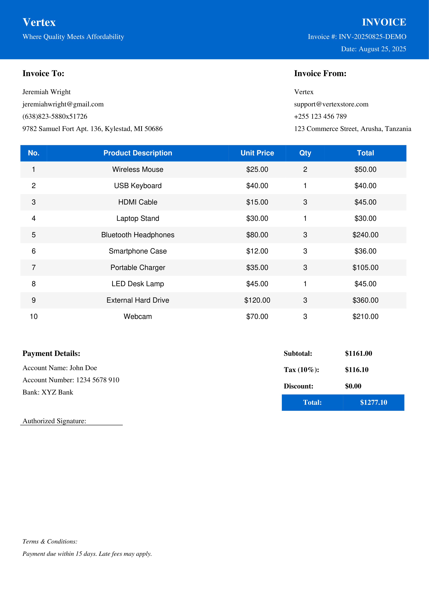

<h1 align='center'>🧾 Invoice Generator (Python FPDF)</h1>

<div align='center'>

 
 
 
 
[](https://linkedin.com/in/jabulente-208019349)  

</div>


A **Python-based Invoice Generator** designed to create **professional PDF invoices** for retail shops and businesses. This tool enables dynamic invoice creation with **customizable client and seller information**, **itemized product lists**, **automatic tax calculations**, and **payment summaries**, ensuring your invoicing process is accurate, efficient, and visually appealing. Built using the lightweight **FPDF library**.


## 🚀 Features

* **Dynamic Invoices** – Auto-generated invoice numbers and dates.
* **Custom Info** – Add client and seller details effortlessly.
* **Itemized Billing** – Multiple products with quantity, price, and totals.
* **Automatic Calculations** – Subtotal, taxes, discounts, and grand total computed.
* **Professional Layout** – Clean headers, footers, and styled tables.
* **PDF Export** – Save and share print-ready invoices.


## 🛠️ Tools, Libraries & Technology

* **Python 3.x** – Core programming language
* **FPDF** – Lightweight PDF generation library for Python
* **OS & File Handling** – For managing PDF output directories
* **Datetime** – For automated date and timestamp generation
* **Math Operations** – For subtotal, tax, discount, and grand total calculations

## 💡 Usage

This project runs entirely on the Command-Line Interface (CLI)

1. **Install Dependencies**
   Ensure **FPDF** is installed:

```bash
pip install fpdf pandas
```

2. **Prepare Dataset**
   Create or update your dataset with invoice information. Ensure the **data schema matches the expected fields** (e.g., seller info, client info, item details, tax, discount).

3. **Configure Settings**
   Update the configuration in the script to point to your dataset and adjust any necessary parameters.

4. **Run the Invoice Generator**

```bash
python main.py
```

5. **Generate PDF Invoices**
   The script reads your dataset, processes the information, and **outputs professional PDF invoices** in the configured folder.


## 📄 Sample Output

Below are examples of invoices generated by the Vertex Invoice Generator:

### 1. Full Product Invoice



## 🏆 Skills Demonstrated

* Python programming and **object-oriented design**
* **Automated document generation** with FPDF
* **File handling and directory management** in Python
* Implementation of **dynamic calculations** (taxes, discounts, totals)
* **Data structuring and presentation** in professional PDF format
* Attention to **UI/UX in document design** for readability and professionalism

---

## 🔗 Potential Improvements

* Integration with a **database** to store invoice history
* Adding **barcode or QR code** for invoice verification
* Web interface for **online invoice creation and management**
* Support for **multiple currencies and tax systems**
